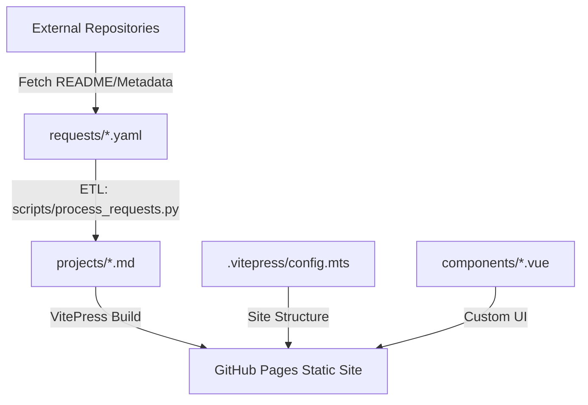

# GEMINI.md - AI Context & Developer Operations

This file provides a consolidated overview of the **justme.dev** project for AI assistants and developers. It defines the project's purpose, architecture, and operational commands.

## 🚀 Quick Description

**justme.dev** is a cloud-native documentation architecture that aggregates content from various GitHub repositories using a custom Python ETL pipeline. It is built on **VitePress** and deployed as a serverless static site on GitHub Pages.

---

## 🛠 Key Commands (from `package.json`)

| Purpose           | Command                        | Description                                                            |
| :---------------- | :----------------------------- | :--------------------------------------------------------------------- |
| **Development**   | `npm run docs:dev`             | Start VitePress dev server with Hot Module Replacement (HMR).          |
| **ETL (Content)** | `npm run docs:generate`        | Run Python script to fetch/transform remote markdown into `projects/`. |
| **ETL (Splats)**  | `npm run docs:generate-splats` | (Optional) Generate/process splat-related assets.                      |
| **Build**         | `npm run docs:build`           | Compile static site for production.                                    |
| **Preview**       | `npm run docs:preview`         | Locally preview the production build.                                  |
| **Linting**       | `npm run lint`                 | Run ESLint with auto-fix enabled.                                      |
| **Formatting**    | `npm run format`               | Run Prettier to format all files.                                      |

---

## 🏗 Architecture & Tech Stack



### Technical Pillars

- **Framework**: VitePress (Vue.js 3 ecosystem).
- **Styling**: Vanilla CSS (Strictly avoid Tailwind unless explicitly requested).
- **Automation**: GitHub Actions (`.github/workflows/deploy.yml`) for automated builds.
- **Data Flow**: Python scripts (`scripts/`) transform raw YAML manifestations into static Markdown content.

---

## 💡 AI Implementation Guide

### 📂 Critical Project Structure

| Path          | Role                               | AI Interaction                                          |
| :------------ | :--------------------------------- | :------------------------------------------------------ |
| `requests/`   | Source manifests for projects.     | Edit these to add/modify external project sources.      |
| `projects/`   | **Generated** documentation.       | **DO NOT EDIT.** Run `npm run docs:generate` to update. |
| `.vitepress/` | Routing, headers, and theme logic. | Modify `config.mts` for global changes.                 |
| `components/` | Custom Vue components.             | Use these for complex UI interactivity.                 |
| `scripts/`    | ETL and generation logic.          | Update these to change how external data is fetched.    |

### 🛠 Common Workflows

#### 1. Adding a New Project

1. Create a `requests/<name>.yaml` file with the correct metadata.
2. Run `npm run docs:generate`.
3. Check `projects/<name>.md` to verify the output.

#### 2. Modifying Global Theme/Navigation

1. Navigate to `.vitepress/config.mts`.
2. Update the `themeConfig` section.
3. Use `npm run docs:dev` to preview changes in real-time.

#### 3. Styling Changes

1. Go to `.vitepress/theme/custom.css` (or equivalent).
2. Use **Vanilla CSS**. Ensure compatibility with VitePress's default styling.

### ⚠️ Guardrails & "Don'ts"

- **🚫 DON'T** edit files in the `projects/` directory directly. They are overwritten by the ETL script.
- **🚫 DON'T** install new CSS frameworks (Tailwind, UnoCSS) without explicit user permission.
- **🚫 DON'T** ignore the `.venv` requirement for Python scripts. Always use the virtual environment.

---

## 🤖 Operational Rules for AI Agents

To maintain code quality and consistency, all agents **MUST** follow these rules:

1.  **Python Environment Awareness**: Before running any script in `scripts/`, ensure the Python virtual environment (`.venv`) is activated and dependencies are installed via `pip install -r requirements.txt`.
2.  **Mandatory Cleanup**: Before marking a task as complete, you **MUST** run:
    ```bash
    npm run format && npm run lint
    ```
3.  **Fix Regressions**: If the lint or format commands reveal errors (especially those introduced by your changes), fix them immediately.
4.  **No Direct Output Edits**: Never modify `projects/*.md` files directly. If project content needs changing, update the manifest in `requests/` or the ETL script in `scripts/`.
5.  **Documentation Continuity**: Always ensure `GEMINI.md` is updated if there are changes to commands, schema in `requests/`, or the core architecture.
